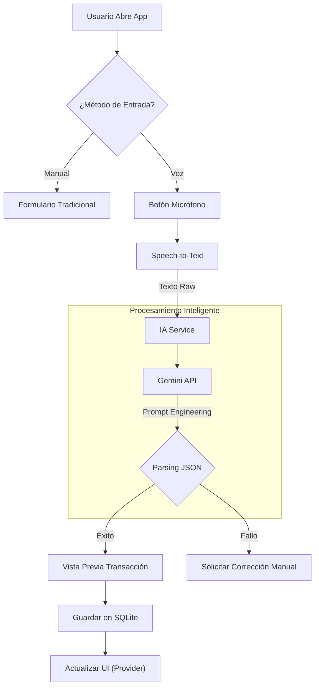

# Visión General: Gestor de Gastos

## 1. Introducción
**Gestor de Gastos** es una aplicación móvil nativa desarrollada en Flutter para la gestión de finanzas personales, optimizada para el mercado peruano. Su principal diferenciador es la integración de un **Coach Financiero** basado en Inteligencia Artificial (Google Gemini) que opera bajo un modelo de "Escasez de Recursos" (bajo consumo de datos y cuota de API).

El proyecto sigue una filosofía **Local-First**, priorizando la privacidad y la velocidad al mantener la base de datos completa en el dispositivo del usuario.

## 2. Tecnologías (Tech Stack)

A continuación, se detalla la pila tecnológica extraída del `pubspec.yaml` actual:

| Tecnología | Paquete / Librería | Versión | Uso Principal |
| :--- | :--- | :--- | :--- |
| **Framework UI** | `flutter` | 3.x | Desarrollo multiplataforma nativo. |
| **Base de Datos** | `sqflite` | ^2.3.0 | Persistencia relacional local (SQLite). |
| **Estado** | `provider` | ^6.0.5 | Gestión de estado (Dependency Injection). |
| **IA (Motor)** | `http` (Raw REST) | ^1.6.0 | Comunicación directa con Gemini API (Control granular). |
| **IA (SDK)** | `google_generative_ai` | ^0.4.7 | SDK alternativo/complementario. |
| **Voz** | `speech_to_text` | ^7.3.0 | Transcripción de audio a texto (STT). |
| **Gráficos** | `fl_chart` | ^0.66.0 | Visualización de estadísticas financieras. |
| **Entorno** | `flutter_dotenv` | ^6.0.0 | Gestión segura de API Keys (.env). |

## 3. Flujo de Usuario (User Journey)

El siguiente diagrama ilustra el flujo principal de registro de transacciones mediante voz:

