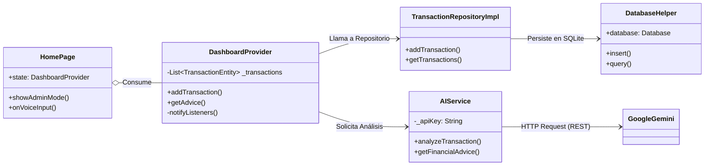

# Arquitectura Técnica

## 1. Patrón de Diseño: Clean Architecture (Simplificada)
El proyecto utiliza una variante de **Clean Architecture** adaptada para la velocidad de desarrollo en Flutter. La estructura de directorios en `lib/` refleja una clara separación de responsabilidades:

1.  **Core (`lib/core/`)**: Lógica central agnóstica de la UI, como servicios de red (`ai_service.dart`) y manejo de errores.
2.  **Domain (`lib/domain/`)**: Lógica pura de negocio (Entidades, Contratos de Repositorios). *Nota: Aunque no se observó explícitamente en el `ls` inicial, es común en este patrón y se infiere su existencia por los `import` en `main.dart`.*
3.  **Data (`lib/data/`)**: Implementación del acceso a datos. Contiene los `repositories`, `models` y `datasources` (`database_helper.dart`).
4.  **Presentation (`lib/presentation/`)**: Capa visual que interactúa con el usuario a través de `pages` y gestiona el estado mediante `providers`.

## 2. Diagrama de Componentes (Mermaid)

El siguiente diagrama muestra cómo los componentes interactúan entre sí:

## 3. Manejo de Estado
La aplicación utiliza el paquete `provider` para gestionar el estado de manera reactiva.
*   **`DashboardProvider`**: Actúa como el *ViewModel* principal, centralizando la lógica de negocio y notificando a `HomePage` y `StatsPage` cuando hay cambios en el saldo o las transacciones.
*   **Inyección de Dependencias**: Se realiza a través de `provider` (o `get_it` si está configurado en `injection_container.dart`), permitiendo desacoplar la UI de la implementación concreta de los servicios.

## 4. Desglose Detallado de Archivos (File Structure)

A continuación, se explica la responsabilidad de cada archivo clave en el directorio `lib/`:

### 📁 Raíz (`lib/`)
*   **`main.dart`**: Punto de entrada de la aplicación. Inicializa Flutter, carga variables de entorno (`dotenv`), configura la inyección de dependencias y lanza el `ChangeNotifierProvider` global.
*   **`injection_container.dart`**: Archivo de configuración de **GetIt**. Aquí se registran todos los Singletons (Database, API) y Factories (Providers, Repositorios) para desacoplar las clases.

### 📁 Core (`lib/core/`)
*Infraestructura y servicios transversales.*
*   **`services/ai_service.dart`**: Cliente HTTP principal para Google Gemini. Contiene la lógica cruda de `POST Requests`, manejo de API Keys y limpieza de respuestas JSON.
*   **`services/database_helper.dart`**: Singleton de **SQLite**. Gestiona la creación del archivo `.db`, las migraciones de versión y la apertura de conexiones.
*   **`services/speech_service.dart`**: Wrapper para el plugin `speech_to_text`. Gestiona permisos de micrófono y el stream de audio a texto.
*   **`services/notification_service.dart`**: Maneja notificaciones locales programadas (recordatorios de pagos, alertas de presupuesto).
*   **`services/gemini_client.dart`**: Cliente alternativo o legacy para la IA. Verifica si se usa en conjunto con `ai_service`.
*   **`errors/failure.dart`**: Clases base para manejo de errores tipados (`ServerFailure`, `CacheFailure`) usados por `dartz`.
*   **`usecases/usecase.dart`**: Clase abstracta base para implementar el patrón Command/UseCase.

### 📁 Domain (`lib/domain/`)
*Reglas de Negocio Puras (Entities).*
*   **`entities/transaction_entity.dart`**: Objeto central. Define qué es una transacción (id, monto, fecha, categoría).
*   **`entities/account_entity.dart`**: Representa una cuenta financiera (Efectivo, Banco).
*   **`entities/category_entity.dart`**: Categorías de gasto (Comida, Transporte, etc.).
*   **`entities/goal_entity.dart`**: Metas de ahorro definidas por el usuario.
*   **`entities/budget_mood.dart`**: Lógica o Enum para calcular la salud financiera.
*   **`repositories/transaction_repository.dart`**: **Contrato (Interface)**. Define *qué* debe hacer la app (guardar, leer) sin decir *cómo*.

### 📁 Data (`lib/data/`)
*Implementación de la Capa de Datos.*
*   **`models/transaction_model.dart`**: Extensión de la Entidad con métodos `fromJson` / `toJson` para serializar hacia SQLite o API.
*   **`models/account_model.dart`**: Adaptador de BD para cuentas.
*   **`repositories/transaction_repository_impl.dart`**: Cerebro de datos. Implementa el contrato del dominio. Decide si leer de SQLite o llamar a la API. Coordina el guardado local.
*   **`repositories/transaction_data_source.dart`**: Abstracción de bajo nivel para acceso a datos (DAO).

### 📁 Presentation (`lib/presentation/`)
*Interfaz de Usuario y Estado.*

#### Providers (State Management)
*   **`providers/dashboard_provider.dart`**: El **Componente Más Importante** de la UI. Mantiene en memoria la lista de transacciones, calcula saldos totales, gestiona el estado de carga (`isLoading`) y expone funciones para la UI (`addTransaction`, `deleteTransaction`).

#### Pages (Pantallas)
*   **`pages/main_page.dart`**: Contenedor principal con `BottomNavigationBar` para navegar entre secciones.
*   **`pages/home_page.dart`**: Pantalla de inicio. Muestra el resumen, la "Carita" (Mood) y las transacciones recientes.
*   **`pages/add_transaction_page.dart`**: Formulario para ingreso manual de gastos.
*   **`pages/stats_page.dart`**: Pantalla de análisis con gráficos (`fl_chart`) desglosados por categoría.
*   **`pages/wallet_page.dart`**: Gestión de cuentas (Crear nueva cuenta, ver saldos individuales).
*   **`pages/history_page.dart`**: Historial completo con buscador y filtros avanzados.
*   **`pages/settings_page.dart`**: Ajustes de usuario (Tema oscuro, Reset de datos, Perfil).
*   **`pages/onboarding_page.dart` y `intro_page.dart`**: Flujo de bienvenida para nuevos usuarios.
*   **`pages/lock_screen.dart`**: Pantalla de seguridad (PIN/Biometría) si está activa.
*   **`pages/transaction_search_delegate.dart`**: Lógica de búsqueda (SearchDelegate) para filtrar transacciones en la AppBar.
