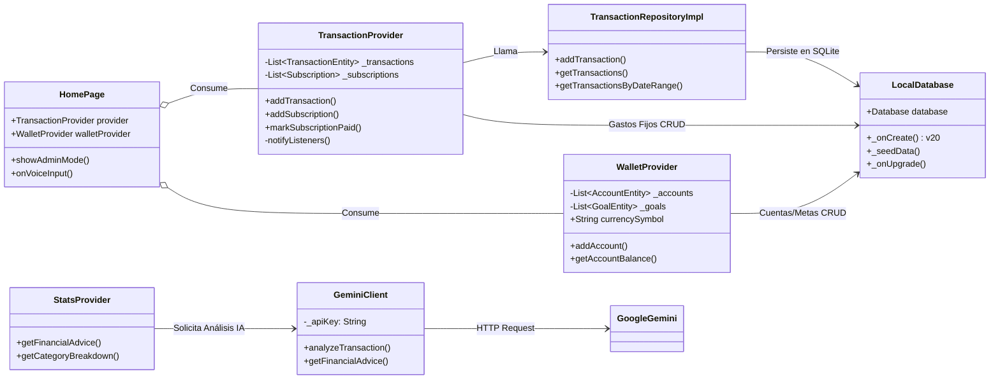
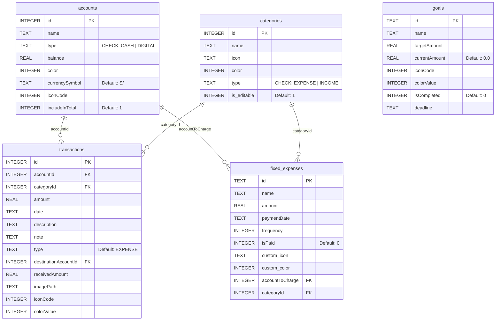

# Arquitectura Técnica (v20)

## 1. Patrón de Diseño: Clean Architecture (Simplificada)
El proyecto implementa una variante pragmática de **Clean Architecture** adaptada para Flutter. La estructura de `lib/` refleja una clara separación de responsabilidades en 4 capas:

```
lib/
├── main.dart                          # Punto de entrada
├── injection_container.dart           # GetIt (Service Locator)
├── core/                              # Infraestructura transversal
│   ├── constants/                     # Configuración estática
│   │   ├── app_categories.dart        # Master Seed de categorías
│   │   ├── app_filters.dart           # Filtros dinámicos para Historial
│   │   ├── app_onboarding_data.dart   # Datos del flujo de bienvenida
│   │   └── icon_mapper.dart           # Diccionario de íconos (String → IconData)
│   ├── errors/
│   │   └── failure.dart               # Tipos de error (ServerFailure, CacheFailure)
│   ├── services/
│   │   ├── database_helper.dart       # Singleton SQLite (LocalDatabase)
│   │   ├── gemini_client.dart         # Cliente Gemini (IA Coach + Voz)
│   │   ├── notification_service.dart  # Notificaciones locales programadas
│   │   ├── secure_storage_service.dart# Almacenamiento seguro (PIN)
│   │   └── speech_service.dart        # Wrapper para STT
│   ├── usecases/
│   │   └── usecase.dart               # Clase abstracta base UseCase
│   └── utils/
│       └── currency_formatter.dart    # Formateo de moneda
├── domain/                            # Reglas de negocio puras
│   ├── entities/
│   │   ├── account_entity.dart
│   │   ├── balance_breakdown.dart
│   │   ├── budget_mood.dart
│   │   ├── category_entity.dart
│   │   ├── goal_entity.dart
│   │   └── transaction_entity.dart
│   ├── repositories/
│   │   └── transaction_repository.dart   # Contrato (Interface)
│   └── usecases/
│       ├── account_usecases.dart
│       ├── add_transaction_usecase.dart
│       ├── delete_account_usecase.dart
│       ├── delete_transaction_usecase.dart
│       ├── get_account_balance_usecase.dart
│       ├── get_budget_mood_usecase.dart
│       ├── get_monthly_budget_usecase.dart
│       ├── get_transactions_by_date_range_usecase.dart
│       ├── get_transactions_usecase.dart
│       ├── update_account_usecase.dart
│       └── update_transaction_usecase.dart
├── data/                              # Implementación de datos
│   ├── models/
│   │   ├── account_model.dart
│   │   ├── category_model.dart
│   │   ├── goal_model.dart
│   │   ├── subscription.dart          # Modelo de Gasto Fijo (Subscription)
│   │   └── transaction_model.dart
│   └── repositories/
│       ├── transaction_data_source.dart      # DAO (Data Access Object)
│       └── transaction_repository_impl.dart  # Implementación del contrato
└── presentation/                      # Capa visual
    ├── providers/
    │   ├── stats_provider.dart         # Estado de estadísticas y Coach IA
    │   ├── transaction_provider.dart   # Estado de transacciones y gastos fijos
    │   ├── ui_provider.dart            # Estado de UI (tema, navegación)
    │   └── wallet_provider.dart        # Estado de cuentas y saldos
    ├── widgets/
    │   └── budget_mood_widget.dart     # Widget de humor presupuestario
    └── features/
        ├── auth/
        │   ├── intro_page.dart         # Pantalla de introducción
        │   ├── lock_screen.dart        # Pantalla de bloqueo PIN
        │   ├── onboarding_page.dart    # Flujo de bienvenida
        │   └── widgets/               # Widgets de autenticación
        ├── dashboard/
        │   ├── home_page.dart          # Pantalla principal (Resumen)
        │   └── main_page.dart          # Shell con BottomNavigationBar
        ├── stats/
        │   ├── stats_page.dart         # Gráficas y análisis
        │   └── financial_coach_sheet.dart # BottomSheet del Coach IA
        ├── transactions/
        │   ├── add_transaction_page.dart       # Formulario de nueva transacción
        │   ├── history_page.dart               # Historial con filtros
        │   └── transaction_search_delegate.dart # Buscador
        ├── wallet/
        │   ├── wallet_page.dart        # Gestión de billetera
        │   └── widgets/
        │       ├── account_card.dart
        │       ├── add_account_sheet.dart
        │       ├── add_fixed_expense_sheet.dart  # ⭐ Hoja de Gastos Fijos
        │       ├── fixed_expense_card.dart
        │       ├── goal_card.dart
        │       ├── goal_deposit_dialog.dart
        │       ├── goal_detail_sheet.dart
        │       └── goal_form_sheet.dart
        └── settings/
            └── settings_page.dart      # Ajustes del usuario
```

## 2. Diagrama de Componentes


```mermaid
classDiagram
    direction LR
    
    %% Capa de Presentación
    class HomePage {
        +TransactionProvider provider
        +WalletProvider walletProvider
        +showAdminMode()
        +onVoiceInput()
    }
    
    class TransactionProvider {
        -List~TransactionEntity~ _transactions
        -List~Subscription~ _subscriptions
        +addTransaction()
        +addSubscription()
        +markSubscriptionPaid()
        -notifyListeners()
    }

    class WalletProvider {
        -List~AccountEntity~ _accounts
        -List~GoalEntity~ _goals
        +String currencySymbol
        +addAccount()
        +getAccountBalance()
    }

    class StatsProvider {
        +getFinancialAdvice()
        +getCategoryBreakdown()
    }
    
    %% Capa de Dominio/Data
    class TransactionRepositoryImpl {
        +addTransaction()
        +getTransactions()
        +getTransactionsByDateRange()
    }
    
    %% Capa de Infraestructura
    class LocalDatabase {
        +Database database
        +_onCreate() v20
        +_seedData()
        +_onUpgrade()
    }
    
    class GeminiClient {
        -_apiKey: String
        +analyzeTransaction()
        +getFinancialAdvice()
    }

    %% Relaciones
    HomePage o-- TransactionProvider : Consume
    HomePage o-- WalletProvider : Consume
    TransactionProvider --> TransactionRepositoryImpl : Llama
    TransactionProvider --> LocalDatabase : Gastos Fijos CRUD
    WalletProvider --> LocalDatabase : Cuentas/Metas CRUD
    StatsProvider --> GeminiClient : Solicita Análisis IA
    TransactionRepositoryImpl --> LocalDatabase : Persiste en SQLite
    GeminiClient --> GoogleGemini : HTTP Request
```

## 3. Manejo de Estado

La aplicación utiliza **4 Providers** especializados inyectados vía `MultiProvider` en `main.dart`:

| Provider | Responsabilidad |
| :--- | :--- |
| `TransactionProvider` | CRUD de transacciones y gastos fijos (`Subscription`). Cálculo de saldos. |
| `WalletProvider` | CRUD de cuentas, metas de ahorro, moneda activa. |
| `StatsProvider` | Consultas agregadas, breakdown por categoría, interacción con Coach IA. |
| `UIProvider` | Estado visual: tema (dark/light), página activa en navegación. |

La inyección de dependencias se realiza a través de `GetIt` configurado en `injection_container.dart`, registrando Singletons (Database, Services) y Factories (Repositories, UseCases).

## 4. Base de Datos SQLite — Esquema v20

### 4.1 Estrategia de Migración: Wipe & Rebuild

La versión 20 implementó un **Wipe & Rebuild (Clean Slate)**: al migrar desde cualquier versión anterior (`oldVersion < 20`), se eliminan todas las tablas y se recrean desde cero con el esquema limpio actual. Esto se justificó por la acumulación de 16 migraciones incrementales (v2→v17) que generaban inconsistencias en la tabla `categories`.

```dart
// database_helper.dart — Extracto de _onUpgrade
if (oldVersion < 20 && oldVersion > 0) {
  await db.execute("DROP TABLE IF EXISTS transactions");
  await db.execute("DROP TABLE IF EXISTS fixed_expenses");
  await db.execute("DROP TABLE IF EXISTS goals");
  await db.execute("DROP TABLE IF EXISTS categories");
  await db.execute("DROP TABLE IF EXISTS accounts");
  await _onCreate(db, newVersion);
}
```

### 4.2 Esquema de Tablas


```mermaid
erDiagram
    accounts {
        INTEGER id PK
        TEXT name
        TEXT type "CHECK: CASH | DIGITAL"
        REAL balance
        INTEGER color
        TEXT currencySymbol "Default: S/"
        INTEGER iconCode
        INTEGER includeInTotal "Default: 1"
    }
    
    categories {
        INTEGER id PK
        TEXT name
        TEXT icon
        INTEGER color
        TEXT type "CHECK: EXPENSE | INCOME"
        INTEGER is_editable "Default: 1"
    }
    
    transactions {
        INTEGER id PK
        INTEGER accountId FK
        INTEGER categoryId FK
        REAL amount
        TEXT date
        TEXT description
        TEXT note
        TEXT type "Default: EXPENSE"
        INTEGER destinationAccountId FK
        REAL receivedAmount
        TEXT imagePath
        INTEGER iconCode
        INTEGER colorValue
    }
    
    fixed_expenses {
        TEXT id PK
        TEXT name
        REAL amount
        TEXT paymentDate
        INTEGER frequency
        INTEGER isPaid "Default: 0"
        TEXT custom_icon
        INTEGER custom_color
        INTEGER accountToCharge FK
        INTEGER categoryId FK
    }
    
    goals {
        TEXT id PK
        TEXT name
        REAL targetAmount
        REAL currentAmount "Default: 0.0"
        INTEGER iconCode
        INTEGER colorValue
        INTEGER isCompleted "Default: 0"
        TEXT deadline
    }
    
    accounts ||--o{ transactions : "accountId"
    categories ||--o{ transactions : "categoryId"
    accounts ||--o{ fixed_expenses : "accountToCharge"
    categories ||--o{ fixed_expenses : "categoryId"
```

### 4.3 Semilla de Categorías (v20) y Protección Core

Al crear la base de datos por primera vez (`_onCreate` → `_seedData`), se insertan **15 categorías predeterminadas** con `is_editable = 0`, lo que las marca como **categorías Core protegidas** que no pueden ser eliminadas ni renombradas por el usuario.

#### Categorías de Gasto (10)

| ID | Nombre | Ícono | Color |
| :--- | :--- | :--- | :--- |
| 1 | Alimentación | `restaurant` | 🟠 `0xFFFB8C00` |
| 2 | Vivienda | `home` | 🔘 `0xFF607D8B` |
| 3 | Transporte | `directions_bus` | 🔵 `0xFF2196F3` |
| 4 | Servicios | `bolt` | 🟠 `0xFFF57C00` |
| 5 | Salud | `local_hospital` | 🟢 `0xFF009688` |
| 6 | Educación | `school` | 🟤 `0xFF795548` |
| 7 | Entretenimiento | `movie` | 🔵 `0xFF3F51B5` |
| 8 | Compras | `shopping_bag` | 🩷 `0xFFE91E63` |
| 9 | Deudas | `money_off` | 🟠 `0xFFFF5722` |
| 10 | Otros Gastos | `grid_view` | ⚫ `0xFF9E9E9E` |

#### Categorías de Ingreso (5)

| ID | Nombre | Ícono | Color |
| :--- | :--- | :--- | :--- |
| 11 | Sueldo | `monetization_on` | 🟢 `0xFF2E7D32` |
| 12 | Negocio | `work` | 🔵 `0xFF0D47A1` |
| 13 | Inversiones | `trending_up` | 🟣 `0xFF9C27B0` |
| 14 | Regalos | `card_giftcard` | 🩷 `0xFFFF4081` |
| 15 | Otros Ingresos | `category` | 🔘 `0xFF607D8B` |

> **Nota sobre `is_editable`:** Las categorías Core se insertan con `is_editable = 0`. El campo tiene un `DEFAULT 1` en el esquema DDL, lo cual permite que categorías futuras creadas por el usuario sean editables por defecto.

### 4.4 Índices de Rendimiento

```sql
CREATE INDEX idx_transactions_date ON transactions(date);
CREATE INDEX idx_transactions_accountId ON transactions(accountId);
```

### 4.5 Configuración de Integridad

```sql
PRAGMA foreign_keys = ON;  -- Activado en _onConfigure
```

Las Foreign Keys activan cascada:
- `transactions.accountId` → `ON DELETE CASCADE`
- `transactions.categoryId` → `ON DELETE CASCADE`
- `fixed_expenses.accountToCharge` → `ON DELETE SET NULL`
- `fixed_expenses.categoryId` → `ON DELETE CASCADE`
