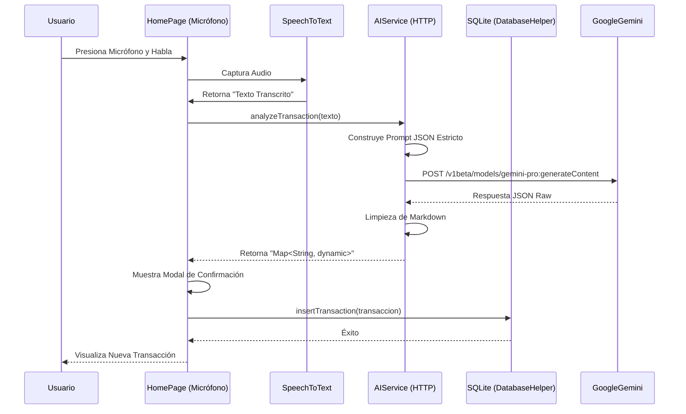

# Inteligencia Artificial en Gestor de Gastos

## 1. Estrategia de IA: Escasez de Recursos
El sistema está diseñado para operar bajo un límite estricto de **20 Peticiones Por Día (RPD)** de la API de Gemini (en su capa gratuita Flash/Pro).
*   **Modelo:** Gemini 1.5 Flash (v1beta/gemini-pro).
*   **Estrategia:** Se minimizan las llamadas a la API mediante la gestión local (SQLite) y el uso de Prompts "todo en uno" para obtener la máxima cantidad de datos en una sola solicitud.

## 2. Ingeniería de Prompts (Voice Service)
El corazón de la funcionalidad de reconocimiento de voz reside en el prompt estructurado que se envía a la API.

### Prompt del Sistema (Extracto Técnico)
El siguiente prompt se utiliza para el análisis de transacciones:

```dart
// lib/core/services/ai_service.dart

String prompt = """
Eres un asistente financiero. Analiza la frase: '$text'.
Tu objetivo es estructurar la transacción en JSON.

TIPO DE TRANSACCIÓN:
'gasto': (gasté, compré, pagué).
'ingreso': (cobré, recibí, ingreso).
'transferencia': (moví, pasé, transferí).

CUENTA / MÉTODO DE PAGO (Dinámico):
Detecta patrones como: 'con [Nombre]', 'desde [Nombre]', 'por [Nombre]'.
Ejemplos: 'con BCP', 'por Yape', 'de mi Ahorro'.
Extrae el nombre exacto.
...
""";
```

### Tabla de Comandos de Voz
A continuación, ejemplos de cómo el sistema interpreta diferentes frases:

| Frase del Usuario | Tipo Detectado | Monto | Cuenta Detectada | Categoría Inferida |
| :--- | :--- | :--- | :--- | :--- |
| *"Gasté 15 soles en menú con Yape"* | Gasto | **15.00** | **Yape** | **Comida** |
| *"Me pagaron 500 soles en BCP"* | Ingreso | **500.00** | **BCP** | **Sueldo/Ingreso** |
| *"Transferí 20 soles a Ahorros"* | Transferencia | **20.00** | **Ahorros** | **Transferencia** |
| *"Compré audífonos por 50"* | Gasto | **50.00** | `null` | **Tecnología/Varios** |

## 3. Flujo de Datos (Sequence Diagram)

El siguiente diagrama de secuencia detalla el proceso desde que el usuario habla hasta que se guarda la transacción:


