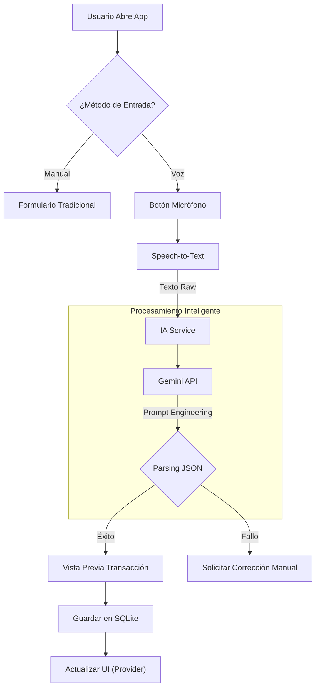
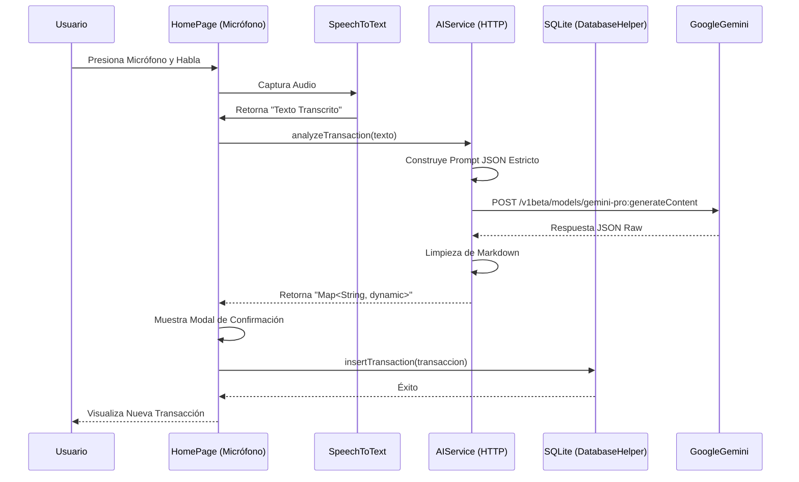
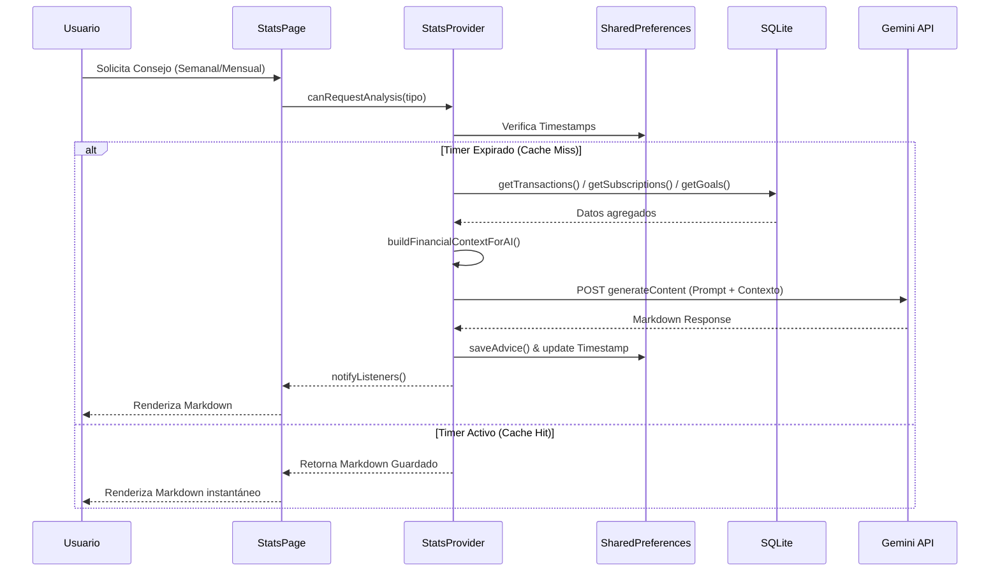

# Inteligencia Artificial en Gestor de Gastos

## 1. Estrategia de IA: Escasez de Recursos
El sistema está diseñado para operar bajo un límite estricto de **Peticiones Por Día (RPD)** de la API de Gemini (en su capa gratuita).
*   **Modelo:** Gemini 1.5 Flash / Gemini Pro.
*   **Cliente:** `GeminiClient` (`lib/core/services/gemini_client.dart`) — Comunicación HTTP directa con control granular.
*   **Renderizado:** Las respuestas del Coach se renderizan con `flutter_markdown_plus` para formato rico.
*   **Estrategia:** Se minimizan las llamadas a la API mediante la gestión local (SQLite) y el uso de Prompts "todo en uno" para obtener la máxima cantidad de datos en una sola solicitud.
*   **Estado:** Gestionado por `StatsProvider` (`lib/presentation/providers/stats_provider.dart`).

## 2. Ingeniería de Prompts (Voice Service)
El corazón de la funcionalidad de reconocimiento de voz reside en el prompt estructurado que se envía a la API.

### Prompt del Sistema (Extracto Técnico)
El siguiente prompt se utiliza para el análisis de transacciones:

```dart
// lib/core/services/ai_service.dart

String prompt = """
Eres un asistente financiero. Analiza la frase: '$text'.
Tu objetivo es estructurar la transacción en JSON.

TIPO DE TRANSACCIÓN:
'gasto': (gasté, compré, pagué).
'ingreso': (cobré, recibí, ingreso).
'transferencia': (moví, pasé, transferí).

CUENTA / MÉTODO DE PAGO (Dinámico):
Detecta patrones como: 'con [Nombre]', 'desde [Nombre]', 'por [Nombre]'.
Ejemplos: 'con BCP', 'por Yape', 'de mi Ahorro'.
Extrae el nombre exacto.
...
""";
```

### Tabla de Comandos de Voz
A continuación, ejemplos de cómo el sistema interpreta diferentes frases:

| Frase del Usuario | Tipo Detectado | Monto | Cuenta Detectada | Categoría Inferida |
| :--- | :--- | :--- | :--- | :--- |
| *"Gasté 15 soles en menú con Yape"* | Gasto | **15.00** | **Yape** | **Comida** |
| *"Me pagaron 500 soles en BCP"* | Ingreso | **500.00** | **BCP** | **Sueldo/Ingreso** |
| *"Transferí 20 soles a Ahorros"* | Transferencia | **20.00** | **Ahorros** | **Transferencia** |
| *"Compré audífonos por 50"* | Gasto | **50.00** | `null` | **Tecnología/Varios** |

### Flujo de Usuario (User Journey)

El siguiente diagrama ilustra el flujo principal de registro de transacciones mediante voz:


```mermaid
graph TD
    A["Usuario Abre App"] --> B{"¿Método de Entrada?"}
    B -->|Manual| C["Formulario Tradicional"]
    B -->|Voz| D["Botón Micrófono"]
    
    D --> E["Speech-to-Text"]
    E -->|Texto Raw| F["IA Service"]
    
    subgraph "Procesamiento Inteligente"
        F --> G["Gemini API"]
        G -->|Prompt Engineering| H{"Parsing JSON"}
    end
    
    H -->|Éxito| I["Vista Previa Transacción"]
    H -->|Fallo| J["Solicitar Corrección Manual"]
    
    I --> K["Guardar en SQLite"]
    K --> L["Actualizar UI (Provider)"]
```

## 3. Flujo de Datos (Sequence Diagram)

El siguiente diagrama de secuencia detalla el proceso desde que el usuario habla hasta que se guarda la transacción:


```mermaid
sequenceDiagram
    participant User as Usuario
    participant UI as HomePage (Micrófono)
    participant STT as SpeechToText
    participant AI as AIService (HTTP)
    participant DB as SQLite (DatabaseHelper)
    
    User->>UI: Presiona Micrófono y Habla
    UI->>STT: Captura Audio
    STT->>UI: Retorna "Texto Transcrito"
    
    UI->>AI: analyzeTransaction(texto)
    AI->>AI: Construye Prompt JSON Estricto
    AI->>GoogleGemini: POST /v1beta/models/gemini-pro:generateContent
    GoogleGemini-->>AI: Respuesta JSON Raw
    
    AI->>AI: Limpieza de Markdown
    AI-->>UI: Retorna "Map<String, dynamic>"
    
    UI->>UI: Muestra Modal de Confirmación
    UI->>DB: insertTransaction(transaccion)
    DB-->>UI: Éxito
    UI-->>User: Visualiza Nueva Transacción
```

## 4. El Coach Financiero (Análisis de Estadísticas)

### 4.1 Prompt Engineering (El Rol del Coach)

El Coach Financiero opera como un "Asesor Personal de Élite". A diferencia de la entrada por voz que espera una respuesta JSON estricta, el Coach devuelve texto enriquecido en formato **Markdown**, el cual es renderizado en la UI para ofrecer una experiencia visual agradable (incluyendo negritas, listas y emojis).

**Prompt del Sistema (Extracto Técnico):**
```dart
// lib/core/services/gemini_client.dart
const systemInstruction = """
Eres un Asesor Financiero personal de élite. Analiza los datos proporcionados y da insights accionables y directos.

REGLAS ESTRICTAS:
1. Basa tu análisis ÚNICAMENTE en los datos enviados. Cero alucinaciones.
2. Tono: Profesional, motivador, conciso y de tú a tú.
3. Usa SIEMPRE el símbolo de moneda indicado en los datos financieros del usuario.
4. ALERTA ROJA: Si un Gasto Fijo vence pronto (hoy o mañana), menciónalo primero. ALERTA AMARILLA: Si los gastos superan el 80% del presupuesto.
5. Comenta siempre el progreso de las Metas si existen.

ESTRUCTURA MARKDOWN OBLIGATORIA: 
- Usa emojis sutiles y resalta montos en negritas (ej: **S/ 500.00**). 
- Usa encabezados claros:
  🔴 Atención Inmediata (si aplica)
  📊 Radiografía del Periodo
  🎯 Tus Metas
  💡 El Consejo del Coach
""";
```

**Inyección Dinámica de Contexto:**
Para evitar gastar tokens excesivos enviando miles de transacciones individuales, `StatsProvider` compila un resumen contable riguroso (`buildFinancialContextForAI()`). Inyecta en texto plano los **Totales de Ingresos/Gastos**, el **Top 5 de Categorías**, los **Gastos Fijos** activos y el progreso de las **Metas de Ahorro**.

```dart
// lib/presentation/providers/stats_provider.dart (Extracto)
buffer.writeln("--- RESUMEN DEL PERIODO ---");
buffer.writeln("Total Ingresos: \$currencySymbol \${totalIncome.toStringAsFixed(2)}");
buffer.writeln("Total Gastos: \$currencySymbol \${totalExpense.toStringAsFixed(2)}");
// ... se agregan Top 5 Categorías, Gastos Fijos y Metas ...
```

### 4.2 Flujo de Datos y Caché (Sequence Diagram)

El siguiente diagrama ilustra el ciclo de vida completo del Coach Financiero, destacando la capa de persistencia en caché:


```mermaid
sequenceDiagram
    participant User as Usuario
    participant UI as StatsPage
    participant Provider as StatsProvider
    participant Cache as SharedPreferences
    participant DB as SQLite
    participant AI as Gemini API
    
    User->>UI: Solicita Consejo (Semanal/Mensual)
    UI->>Provider: canRequestAnalysis(tipo)
    Provider->>Cache: Verifica Timestamps
    
    alt Timer Expirado (Cache Miss)
        Provider->>DB: getTransactions() / getSubscriptions() / getGoals()
        DB-->>Provider: Datos agregados
        Provider->>Provider: buildFinancialContextForAI()
        Provider->>AI: POST generateContent (Prompt + Contexto)
        AI-->>Provider: Markdown Response
        Provider->>Cache: saveAdvice() & update Timestamp
        Provider-->>UI: notifyListeners()
        UI-->>User: Renderiza Markdown
    else Timer Activo (Cache Hit)
        Provider-->>UI: Retorna Markdown Guardado
        UI-->>User: Renderiza Markdown instantáneo
    end
```

### 4.3 Gestión de Cuota y Timers (Modelo de Escasez)

**Modelo de Escasez:** 
Para mitigar las limitaciones de la cuota gratuita de la API de Gemini (aproximadamente 20-50 peticiones/día dependiendo del tier), la aplicación realiza el procesamiento pesado (agregaciones, sumatorias, filtrado por fechas) directamente en el dispositivo usando **SQLite**. En lugar de enviar cada transacción individual a la IA (lo cual detonaría el límite de tokens y la cuota de red), el sistema envía un **único prompt consolidado** y pre-masticado.

**Temporizadores y Persistencia:**
Se utiliza `SharedPreferences` dentro del `StatsProvider` (`saveWeeklyAdvice` / `saveMonthlyAdvice`) para almacenar tanto el texto Markdown generado como la marca de tiempo (Timestamp) del análisis. Esto bloquea llamadas repetitivas innecesarias: un análisis "Semanal" se bloquea por 7 días, y uno "Mensual" por 30 días, protegiendo así la infraestructura.

**Modo Administrador (Bypassing):**
En entornos de desarrollo (`kDebugMode`), existe un panel de administrador oculto (detallado en el `04_MANUAL_ADMIN.md`) que incluye la capacidad de limpiar estos temporizadores de almacenamiento caché mediante la función `resetCoachTimers()`. Esto permite evadir temporalmente la restricción de tiempo y facilita las pruebas de QA del Coach Financiero sin tener que esperar días para una nueva solicitud.
