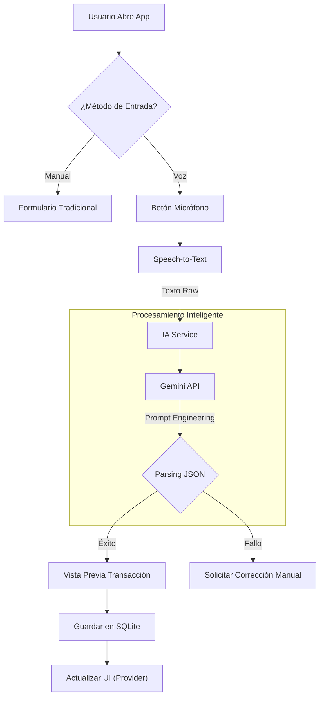
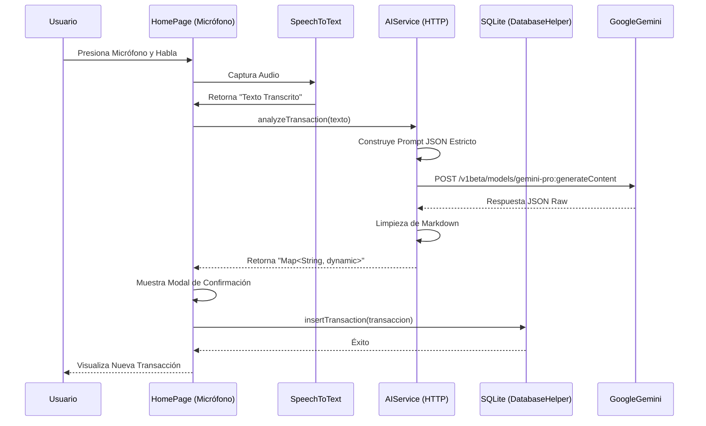

# Inteligencia Artificial en Gestor de Gastos

## 1. Estrategia de IA: Escasez de Recursos
El sistema está diseñado para operar bajo un límite estricto de **Peticiones Por Día (RPD)** de la API de Gemini (en su capa gratuita).
*   **Modelo:** Gemini 1.5 Flash / Gemini Pro.
*   **Cliente:** `GeminiClient` (`lib/core/services/gemini_client.dart`) — Comunicación HTTP directa con control granular.
*   **Renderizado:** Las respuestas del Coach se renderizan con `flutter_markdown_plus` para formato rico.
*   **Estrategia:** Se minimizan las llamadas a la API mediante la gestión local (SQLite) y el uso de Prompts "todo en uno" para obtener la máxima cantidad de datos en una sola solicitud.
*   **Estado:** Gestionado por `StatsProvider` (`lib/presentation/providers/stats_provider.dart`).

## 2. Ingeniería de Prompts (Voice Service)
El corazón de la funcionalidad de reconocimiento de voz reside en el prompt estructurado que se envía a la API.

### Prompt del Sistema (Extracto Técnico)
El siguiente prompt se utiliza para el análisis de transacciones:

```dart
// lib/core/services/ai_service.dart

String prompt = """
Eres un asistente financiero. Analiza la frase: '$text'.
Tu objetivo es estructurar la transacción en JSON.

TIPO DE TRANSACCIÓN:
'gasto': (gasté, compré, pagué).
'ingreso': (cobré, recibí, ingreso).
'transferencia': (moví, pasé, transferí).

CUENTA / MÉTODO DE PAGO (Dinámico):
Detecta patrones como: 'con [Nombre]', 'desde [Nombre]', 'por [Nombre]'.
Ejemplos: 'con BCP', 'por Yape', 'de mi Ahorro'.
Extrae el nombre exacto.
...
""";
```

### Tabla de Comandos de Voz
A continuación, ejemplos de cómo el sistema interpreta diferentes frases:

| Frase del Usuario | Tipo Detectado | Monto | Cuenta Detectada | Categoría Inferida |
| :--- | :--- | :--- | :--- | :--- |
| *"Gasté 15 soles en menú con Yape"* | Gasto | **15.00** | **Yape** | **Comida** |
| *"Me pagaron 500 soles en BCP"* | Ingreso | **500.00** | **BCP** | **Sueldo/Ingreso** |
| *"Transferí 20 soles a Ahorros"* | Transferencia | **20.00** | **Ahorros** | **Transferencia** |
| *"Compré audífonos por 50"* | Gasto | **50.00** | `null` | **Tecnología/Varios** |

### Flujo de Usuario (User Journey)

El siguiente diagrama ilustra el flujo principal de registro de transacciones mediante voz:


```mermaid
graph TD
    A["Usuario Abre App"] --> B{"¿Método de Entrada?"}
    B -->|Manual| C["Formulario Tradicional"]
    B -->|Voz| D["Botón Micrófono"]
    
    D --> E["Speech-to-Text"]
    E -->|Texto Raw| F["IA Service"]
    
    subgraph "Procesamiento Inteligente"
        F --> G["Gemini API"]
        G -->|Prompt Engineering| H{"Parsing JSON"}
    end
    
    H -->|Éxito| I["Vista Previa Transacción"]
    H -->|Fallo| J["Solicitar Corrección Manual"]
    
    I --> K["Guardar en SQLite"]
    K --> L["Actualizar UI (Provider)"]
```

## 3. Flujo de Datos (Sequence Diagram)

El siguiente diagrama de secuencia detalla el proceso desde que el usuario habla hasta que se guarda la transacción:


```mermaid
sequenceDiagram
    participant User as Usuario
    participant UI as HomePage (Micrófono)
    participant STT as SpeechToText
    participant AI as AIService (HTTP)
    participant DB as SQLite (DatabaseHelper)
    
    User->>UI: Presiona Micrófono y Habla
    UI->>STT: Captura Audio
    STT->>UI: Retorna "Texto Transcrito"
    
    UI->>AI: analyzeTransaction(texto)
    AI->>AI: Construye Prompt JSON Estricto
    AI->>GoogleGemini: POST /v1beta/models/gemini-pro:generateContent
    GoogleGemini-->>AI: Respuesta JSON Raw
    
    AI->>AI: Limpieza de Markdown
    AI-->>UI: Retorna "Map<String, dynamic>"
    
    UI->>UI: Muestra Modal de Confirmación
    UI->>DB: insertTransaction(transaccion)
    DB-->>UI: Éxito
    UI-->>User: Visualiza Nueva Transacción
```

## 4. El Coach Financiero (Análisis de Estadísticas)

### 4.1 Modelo de Escasez
Para mitigar las limitaciones de la cuota gratuita de la API de Gemini (aproximadamente 20 peticiones/día), la aplicación compila agregaciones contables completas directamente desde SQLite. En lugar de enviar múltiples solicitudes, el sistema resume los ingresos versus gastos del mes y los envía en un solo prompt consolidado.

### 4.2 Temporizadores y Persistencia
Se utiliza `SharedPreferences` dentro del `StatsProvider` para almacenar marcas de tiempo (timestamps) del último análisis financiero realizado (Semanal o Mensual). Esto bloquea llamadas repetitivas innecesarias a la API de Gemini, protegiendo así la cuota de uso.

### 4.3 Modo Administrador (Bypassing)
En entornos de desarrollo y pruebas (`kDebugMode`), existe un menú o panel de administrador (detallado en el manual de administrador) que incluye la capacidad de limpiar estos temporizadores de almacenamiento caché mediante la función `resetCoachTimers()`. Esto permite evadir temporalmente la restricción de tiempo y facilita las pruebas de QA del Coach Financiero.
