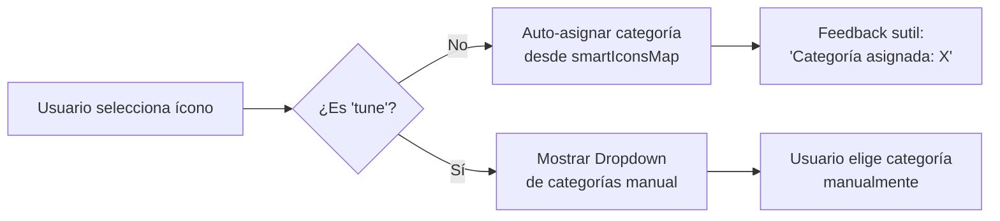
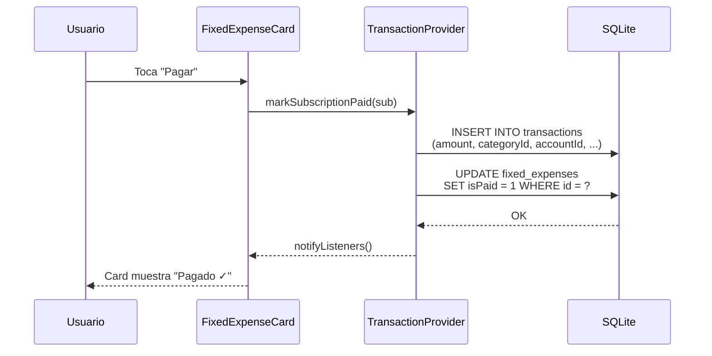

# Sistema de Gastos Fijos y Suscripciones

## 1. Visión General

El módulo de **Gastos Fijos** permite al usuario registrar pagos recurrentes (Netflix, luz, alquiler, etc.) que se cobran automáticamente cada mes o cada año. El diseño sigue un principio fundamental:

> **Independencia visual, herencia contable.** Cada gasto fijo tiene su propia identidad visual (`custom_icon`, `custom_color`) completamente independiente, pero al momento de registrar el pago como transacción, hereda el `categoryId` para alimentar correctamente las gráficas estadísticas.

## 2. Modelo de Datos: `Subscription`

**Archivo:** `lib/data/models/subscription.dart`

```dart
class Subscription {
  final String id;              // UUID único
  final String name;            // "Netflix", "Luz", etc.
  final double amount;          // Monto del cobro
  final DateTime paymentDate;   // Fecha de referencia (día de pago)
  final ExpenseFrequency frequency; // monthly | yearly
  final bool isPaid;            // Estado de pago del ciclo actual
  final String? customIcon;     // Ícono visual personalizado (ej. 'wifi')
  final int? customColor;       // Color ARGB personalizado (ej. 0xFFF44336)
  final int accountToCharge;    // FK → accounts.id
  final int categoryId;         // FK → categories.id (herencia contable)
}
```

### Tabla SQLite: `fixed_expenses`

| Campo | Tipo | Restricción | Descripción |
| :--- | :--- | :--- | :--- |
| `id` | TEXT | PK | UUID generado al crear |
| `name` | TEXT | NOT NULL | Nombre descriptivo |
| `amount` | REAL | NOT NULL | Monto del cobro |
| `paymentDate` | TEXT | NOT NULL | Fecha ISO 8601 |
| `frequency` | INTEGER | NOT NULL | 0 = Mensual, 1 = Anual |
| `isPaid` | INTEGER | DEFAULT 0 | 0 = No pagado, 1 = Pagado |
| `custom_icon` | TEXT | nullable | Nombre del ícono (ej. `'wifi'`) |
| `custom_color` | INTEGER | nullable | Color ARGB (ej. `0xFF2196F3`) |
| `accountToCharge` | INTEGER | FK → accounts | ON DELETE SET NULL |
| `categoryId` | INTEGER | FK → categories | ON DELETE CASCADE |

## 3. Flujo UI: AddFixedExpenseSheet

**Archivo:** `lib/presentation/features/wallet/widgets/add_fixed_expense_sheet.dart`

El formulario presenta un flujo lineal sin pasos (single-scroll):

```
┌──────────────────────────────────┐
│  Selector de Frecuencia          │
│  [ Mensual ]  [ Anual ]         │
├──────────────────────────────────┤
│  Nombre: [___________________]  │
│  Monto:  [___________________]  │
├──────────────────────────────────┤
│  Día de pago (Numeric Stepper)  │
│       [ - ]   15   [ + ]       │
├──────────────────────────────────┤
│  Elige un ícono (Smart Icons)   │
│  ◉ wifi  ◉ bolt  ◉ ...  ◉ tune │
├──────────────────────────────────┤
│  Categoría asignada: Servicios  │
│  (auto-detectada o manual)      │
├──────────────────────────────────┤
│  Elige un Color                 │
│  🔴 🩷 🟣 🔵 🟢 🟡 🟠 ...      │
├──────────────────────────────────┤
│    [ Guardar Gasto Fijo ]       │
└──────────────────────────────────┘
```

### 3.1 Numeric Stepper (Día de Pago)

Para frecuencia **mensual**, el selector de día utiliza un componente **Numeric Stepper** personalizado en lugar de un Dropdown:

- **Botón `−`**: Decrementa el día (mínimo: 1).
- **Campo central**: `TextFormField` numérico editable, centrado, sin bordes decorativos.
- **Botón `+`**: Incrementa el día (máximo: 31).
- **Validación al perder foco**: Si el usuario escribe un valor inválido o deja el campo vacío, se aplica `clamp(1, 31)` automáticamente.
- **Input Formatters**: Solo dígitos (`FilteringTextInputFormatter.digitsOnly`), máximo 2 caracteres.

Para frecuencia **anual**, se muestra un `DatePicker` nativo de Flutter.

## 4. Sistema de Íconos Inteligentes (Smart Icons)

### 4.1 Concepto

En vez de obligar al usuario a seleccionar manualmente tanto un ícono como una categoría estadística, el sistema infiere automáticamente la categoría más probable a partir del ícono elegido. Esto reduce fricción y minimiza errores de categorización.

### 4.2 Mapa de Íconos → Categoría

**Ubicación:** `AddFixedExpenseSheet._smartIconsMap`

| Ícono | Nombre interno | Categoría auto-asignada | ID Cat. |
| :--- | :--- | :--- | :--- |
| 📶 | `wifi` | Servicios | 4 |
| ⚡ | `bolt` | Servicios | 4 |
| 💧 | `water_drop` | Servicios | 4 |
| 📱 | `phone_android` | Servicios | 4 |
| 📺 | `live_tv` | Entretenimiento | 7 |
| 🎮 | `sports_esports` | Entretenimiento | 7 |
| 🎵 | `music_note` | Entretenimiento | 7 |
| 🏠 | `home` | Vivienda | 2 |
| 🧹 | `cleaning_services` | Vivienda | 2 |
| 🚌 | `directions_bus` | Transporte | 3 |
| ⛽ | `local_gas_station` | Transporte | 3 |
| 🚗 | `directions_car` | Transporte | 3 |
| 🎓 | `school` | Educación | 6 |
| 🛒 | `shopping_cart` | Alimentación | 1 |
| 🍽️ | `restaurant` | Alimentación | 1 |
| 🏥 | `medical_services` | Salud | 5 |
| 🏋️ | `fitness_center` | Salud | 5 |
| ✂️ | `content_cut` | Salud | 5 |
| 🐾 | `pets` | Otros Gastos | 10 |

### 4.3 Ícono Comodín (`tune`)

El ícono `tune` (🎛️) es un **comodín** que aparece al final de la grilla. Cuando el usuario lo selecciona, se desactiva la auto-asignación y se despliega un `DropdownButton` completo que permite elegir manualmente cualquiera de las categorías de gasto disponibles en `AppCategories.expenseCategories`.



### 4.4 Feedback Visual

Cuando se selecciona un ícono inteligente (no comodín), se muestra debajo de la grilla un texto informativo sutil:

```
ℹ️ Categoría asignada: Servicios
```

Este feedback se anima con `AnimatedSize` para una transición fluida entre el modo automático y el dropdown manual.

## 5. Diccionario de Íconos: IconMapper

**Archivo:** `lib/core/constants/icon_mapper.dart`

`IconMapper` es una clase utilitaria que convierte nombres de íconos almacenados como `String` en la base de datos a objetos `IconData` de Material Icons. Es el **puente entre la persistencia (SQLite) y la presentación (Flutter)**.

### Íconos soportados (35 en total)

**Categorías Core:**
`restaurant`, `shopping_cart`, `home`, `bolt`, `directions_bus`, `directions_car`, `shopping_bag`, `spa`, `play_circle_filled`, `local_hospital`, `fitness_center`, `movie`, `flight`, `school`, `computer`, `money_off`, `savings`, `monetization_on`, `work`, `trending_up`, `card_giftcard`, `storefront`, `handshake`, `category`, `grid_view`, `fastfood`

**Gastos Fijos (Smart Icons):**
`live_tv`, `wifi`, `water_drop`, `phone_android`, `gamepad`, `sports_esports`, `music_note`, `local_gas_station`, `cleaning_services`, `medical_services`, `content_cut`, `pets`, `tune`

**Fallback:** Cualquier nombre no reconocido retorna `Icons.category`.

## 6. Lógica de Fechas: Clamping de Días

### 6.1 El Problema

Cuando un gasto fijo tiene un día de pago como el **31**, ¿qué sucede en meses que tienen menos días (febrero con 28/29, abril con 30, etc.)?

### 6.2 La Solución: `math.min` Clamping

**Archivo:** `lib/data/models/subscription.dart` — Getter `nextDueDate`

El sistema utiliza `dart:math` para ajustar ("clampear") el día de pago al máximo de días que tiene el mes objetivo:

```dart
// Caso: Ya pagó este mes → calcular próximo mes
int diasDelProximoMes = DateTime(now.year, now.month + 2, 0).day;
int diaDeCobroProximo = math.min(paymentDay, diasDelProximoMes);
return DateTime(now.year, now.month + 1, diaDeCobroProximo);

// Caso: No ha pagado → calcular mes actual
int diasDelMesActual = DateTime(now.year, now.month + 1, 0).day;
int diaDeCobroReal = math.min(paymentDay, diasDelMesActual);
return DateTime(now.year, now.month, diaDeCobroReal);
```

### 6.3 Técnica: `DateTime(year, month + 1, 0)`

Dart permite calcular los días de un mes con el truco `DateTime(año, mes + 1, 0).day`:
- `DateTime(2026, 3, 0).day` → **28** (febrero 2026)
- `DateTime(2026, 5, 0).day` → **30** (abril 2026)
- `DateTime(2026, 2, 0).day` → **31** (enero 2026)

### 6.4 Ejemplos Prácticos

| Día de Pago configurado | Mes Actual | Resultado `nextDueDate.day` |
| :--- | :--- | :--- |
| 31 | Febrero (28 días) | **28** |
| 31 | Abril (30 días) | **30** |
| 31 | Enero (31 días) | **31** |
| 15 | Cualquier mes | **15** (sin cambio) |

Esto garantiza que el sistema **nunca genere una fecha inválida** como "31 de febrero".

## 7. Flujo de Pago (Herencia Contable)

Cuando el usuario marca un gasto fijo como "pagado", el sistema registra automáticamente una transacción en la tabla `transactions`, heredando el `categoryId` del gasto fijo:



La transacción generada hereda:
- `categoryId` → Del gasto fijo (ej. `4` = Servicios)
- `amount` → Del gasto fijo
- `accountId` → De `accountToCharge`
- `description` → Nombre del gasto fijo
- `iconCode` / `colorValue` → Del `custom_icon` / `custom_color` del gasto fijo

Esto asegura que las gráficas de `StatsPage` reflejen correctamente todos los gastos, incluyendo los recurrentes.
